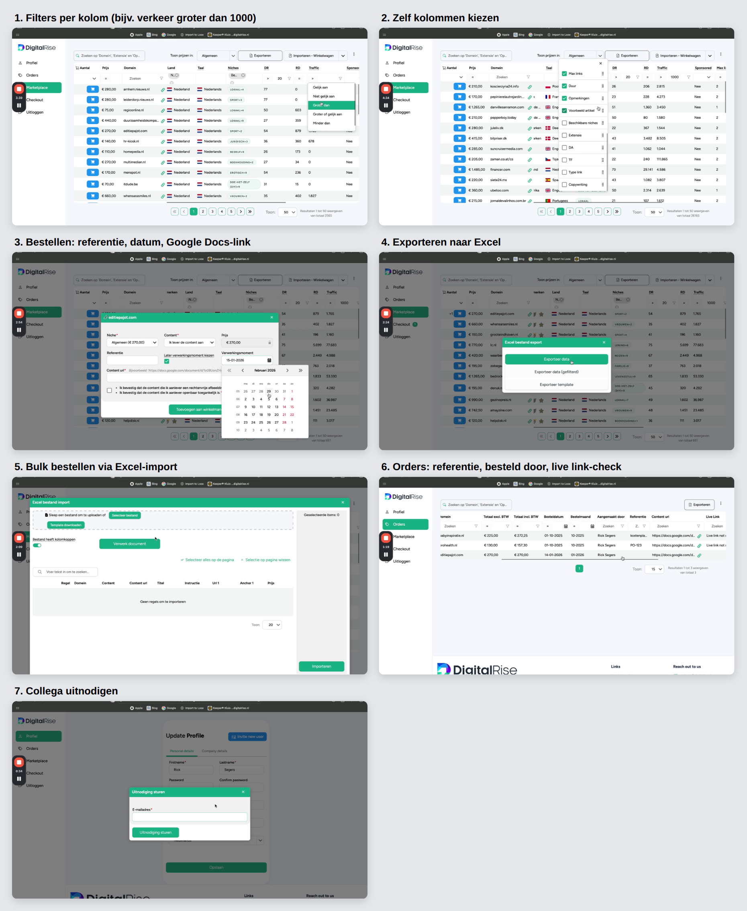
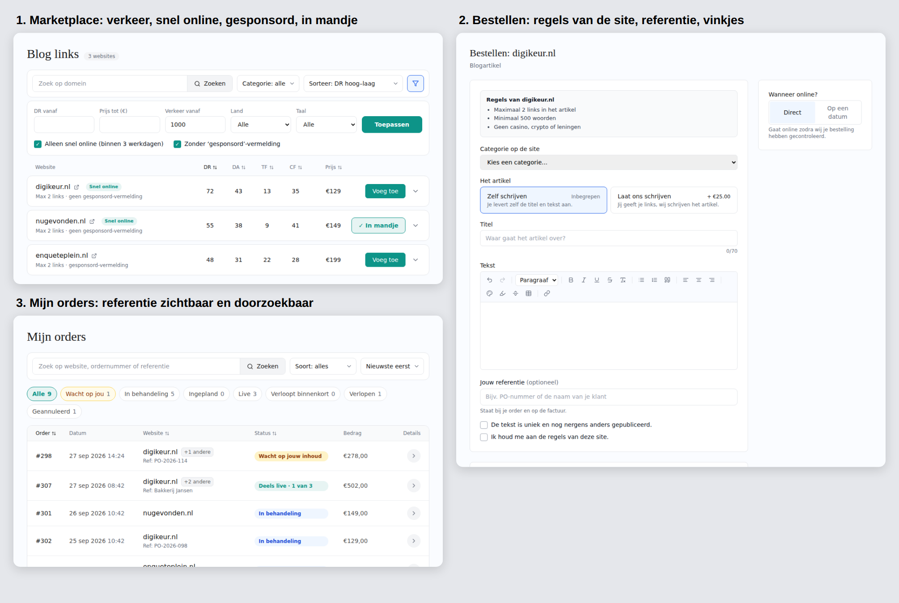

# Nice to have: marketplace-verbeteringen (uit de DigitalRise-video)

Bron: demovideo van DigitalRise (marketplace.digitalrise.nl), 30-9-2026, 5 min,
beeld en geluid bekeken. Leren van, niet kopiëren: eigen rustige stijl houden.

Staan allemaal op Admin → Livegang → Nice to have (vanaf "Referentie bij bestellen").

## Wat DigitalRise laat zien

- **Marketplace**
  - Grote tabel, ongeveer 70.000 domeinen.
  - Filters per kolom: land, niche, DR > 20, verkeer > 1000, duur permanent,
    meer dan 1 link, niet gesponsord.
  - Kolommen zelf kiezen en volgorde slepen.
- **Kenmerken**
  - "Fast supplier": staat altijd binnen 3 werkdagen live.
  - "Nieuw": recent toegevoegde domeinen.
- **Prijs per niche**
  - Algemeen €270; Casino, Crypto en Lening €445 op dezelfde site.
  - "Toon prijzen in:" zet de hele lijst om naar die niche.
- **Per site in de lijst**
  - Max links per artikel (2–3) en duur "Permanent".
  - Opmerkingen van de uitgever, bijv. "alleen legale casinosites" of "max 800 woorden".
  - Voorbeeldartikel ("Bekijk hier").
  - Geaccepteerde niches ("Sport +2").
- **Bestellen (venster)**
  - Niche kiezen.
  - Content zelf aanleveren of laten schrijven.
  - Referentie.
  - Later verwerkingsmoment (datum).
  - Content-URL (Google Docs).
  - Vinkjes: afbeelding rechtenvrij, content openbaar toegankelijk.
  - Daarna "+1" bij de rij en een melding "toegevoegd aan winkelwagen".
- **Excel**
  - Export: alles, gefilterd of een template.
  - Import in het winkelwagen voor bulk bestellen, bijv. maandelijks voor de klanten van een bureau.
- **Afrekenen:** factuur-e-mailadres en bedrijfsnaam, daarna een bedankpagina.
- **Orders**
  - Status en content-status.
  - Filter op bestelmaand, om door te factureren.
  - "Aangemaakt door", referentie, live link-controle ("Live link not retrievable").
  - Melding bij een probleem of "on hold".
- **Profiel:** "Invite new user", zodat collega's onder hetzelfde account bestellen.

## Goedgekeurde voorbeelden (klein)

1. **Referentie bij bestellen**
   - Veld "Jouw referentie (optioneel)", bijv. een PO-nummer of de naam van de klant.
   - Staat bij Mijn orders (klein onder de website), is doorzoekbaar en komt op de factuur.
2. **Filter op verkeer en label Snel online**
   - "Verkeer vanaf" bij Meer filters.
   - Vinkje "Alleen snel online (binnen 3 werkdagen)".
   - Zachtgroen label "Snel online" naast de sitenaam.
3. **In mandje tonen:** knop "✓ In mandje" (zachtgroen, met rand) in plaats van "Voeg toe".
4. **Gesponsord-vermelding per site**
   - Vinkje "Zonder 'gesponsord'-vermelding".
   - Onder de site: "Max 2 links · geen gesponsord-vermelding".
5. **Toestemmingsvinkjes bij bestellen**
   - "De tekst is uniek en nog nergens anders gepubliceerd."
   - "Ik houd me aan de regels van deze site."
   - Geen vinkje voor afbeeldingen: klanten gebruiken alleen de fotozoeker (rechtenvrij).
6. **Regels van de uitgever per site:** grijs vak bovenaan het bestelformulier, bijv. maximaal 2 links,
   minimaal 500 woorden, geen casino, crypto of leningen.

Per site in te vullen bij Admin → Websites:
- snel online ja/nee
- gesponsord-vermelding ja/nee
- max links
- regels

## Groter / zakelijk

- **Prijs per onderwerp (casino, crypto, lening):** eerst bepalen of en tegen welke toeslag.
- **Exporteren naar Excel**
  - Marketplace: de gefilterde lijst.
  - Mijn orders: met de live URL's en een filter op maand.
- **Collega's uitnodigen:** met "Besteld door" bij de order. Past bij Projecten.
- **Controle of de link nog live staat:** wekelijks, met een melding als een link weg is.
- **Bulk bestellen via Excel:** template invullen en alles in één keer in het mandje.
- **Factuur-e-mailadres bij afrekenen:** voor de boekhouding van bureaus.
- **Melding bij probleem met een order:** hoort bij "Mail bij nieuw bericht".

## Niet overnemen

- Filters in elke kolom en zelf kolommen kiezen: maakt het druk.
- Content via een Google Docs-link: onze editor met AI en foto's is beter.
