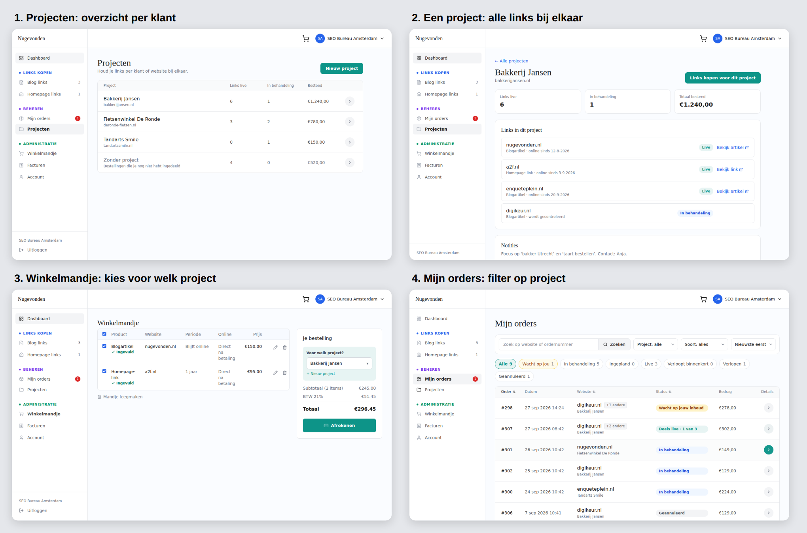
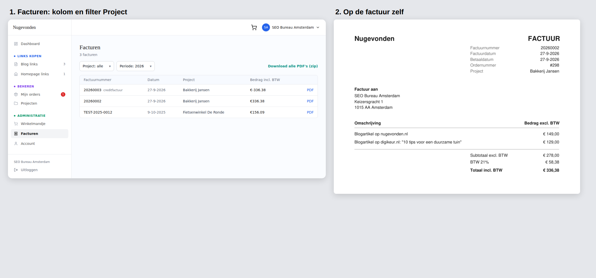

# Nice to have: Projecten goed uitwerken

Staat op Admin → Livegang → Nice to have als "Projecten goed uitwerken".
Goedgekeurd ontwerp (28-9-2026), nog niet gebouwd.

## Waarom

Voor bureaus die links kopen voor meerdere eigen klanten: alles per klant
of website bij elkaar. Tot het af is staat Projecten niet in het klantmenu.

## Hoe het nu zit

- Tabel `Project` (naam, doelwebsite, notities) per klantbedrijf; elke
  `Order` hangt aan een project.
- Bij bestellen kiest de klant niets: het systeem pakt het eerste project
  van het bedrijf, of maakt "Bestellingen" aan.
- De pagina `/dashboard/projects` bestaat nog, maar staat niet meer in het menu.

## Ontwerp

1. **Projecten** (menu: Beheren → Projecten, onder Mijn orders)
   - Tabel met Project (naam + website), Links live, In behandeling, Besteed, pijltje.
   - Onderaan de regel "Zonder project" voor bestellingen die nog niet zijn ingedeeld.
   - Groene knop "Nieuw project".
2. **Eén project**
   - Terug naar "Alle projecten"; naam en website bovenaan.
   - Drie tegels: Links live, In behandeling, Totaal besteed.
   - "Links in dit project": per link website, soort en datum, status en
     "Bekijk artikel/link" (zoals op de orderpagina).
   - Vak Notities.
   - Groene knop "Links kopen voor dit project": de nieuwe bestelling hangt
     dan al aan dit project.
3. **Winkelmandje**
   - In "Je bestelling", boven het totaal: "Voor welk project?" (keuzelijst)
     plus "+ Nieuw project". Geldt voor de hele bestelling.
4. **Mijn orders**
   - Extra filter "Project: alle" naast Soort en sorteren.
   - Onder elke website klein de projectnaam.

## Facturatie

- **Facturen**
  - Kolom Project.
  - Filters Project en Periode.
  - "Download alle PDF's (zip)" voor de gekozen selectie.
- **Factuur-PDF:** regel "Project" onder Ordernummer.
- Een creditfactuur krijgt hetzelfde project als de factuur die hij crediteert.
- Aan de wettelijke factuurregels verandert niets; het project is extra informatie.

## Stijl

Eenvoudig houden en dezelfde opmaak als de rest.

- Groene knoppen (btn-pay).
- Zachtgroen voor actieve filters.
- Geen extra iconen.
